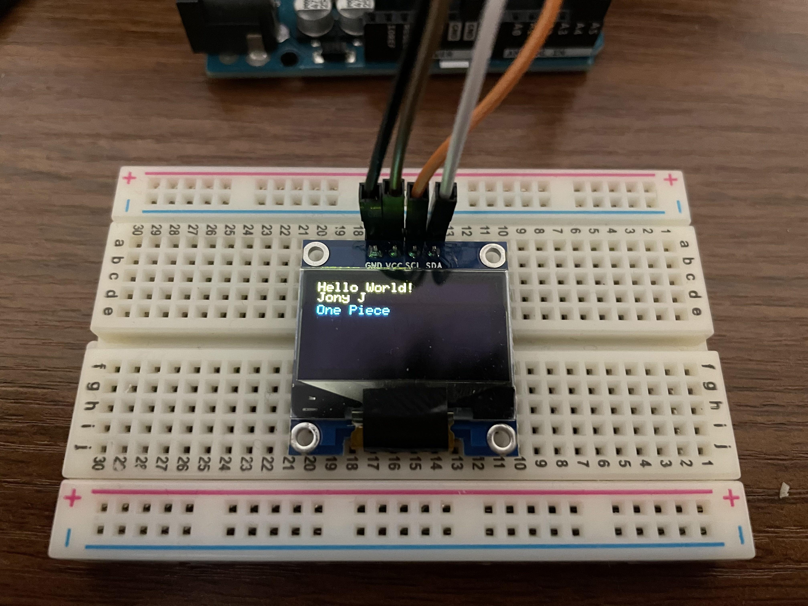

## Simple Arduino library for printing text to OLED with SSD1306 driver

This is a simplified library that supports printing text on OLED with [SSD1306](https://cdn-shop.adafruit.com/datasheets/SSD1306.pdf) driver.

The code is largely distilled from the
[Adafruit_SSD1306](https://github.com/adafruit/Adafruit_SSD1306) library.

---

## Example Usage Program

    // OLED.ino
    #include <SimpleSSD1306.h>

    #define SCREEN_WIDTH 128 // OLED display width, in pixels
    #define SCREEN_HEIGHT 64 // OLED display height, in pixels

    // declare an SSD1306 display object of screen size 128x64
    SimpleSSD1306 oled(SCREEN_WIDTH, SCREEN_HEIGHT);

    void setup()
    {
    Serial.begin(115200);

        // initialize OLED display with display voltage generated internally
        // and I2C address 0x3C
        if (!oled.begin(SSD1306_SWITCHCAPVCC, 0x3C))
        {
            Serial.println(F("SSD1306 allocation failed"));
            while (true)
                ;
        }

        delay(2000); // wait for initializing
        oled.clearDisplay();
        oled.println("Hello World!");
        oled.println("Jony J");
        oled.println("One Piece");
        oled.display();

    }

with result

---

## Issues

- Method for setting cursor position directly has not been added yet.
